# 002 springboot的starter是做什么的？怎么自己实现一个starter？

## 00 前言

在问了我自动配置的问题后，面试官又接着问了我知不知道springboot的starter是做什么的？

我回答是就是集成依赖。面试管又问，怎么自己实现一个starter？

我一下就懵了。

这个东西以前看过，但是没有自己动手做过，只有一点点印象，所以直接回答了不知道。

事实上，在上一篇《我的面试（001）springboot是怎么做到简化配置的？》文章中将自动配置的问题搞清楚后，starter怎么做的基本已经是呼之欲出了。

为了加深记忆，我们就仿照源码手码一个starter出来吧。

## 01 新建starter

1、打开idea,File -> new -> Project,新建一个空项目。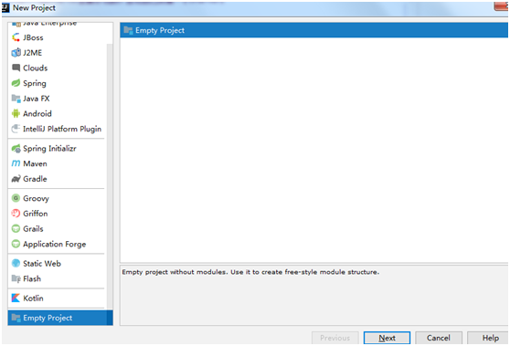

2、点击next，项目名起作yaomaomao-springboot-start。

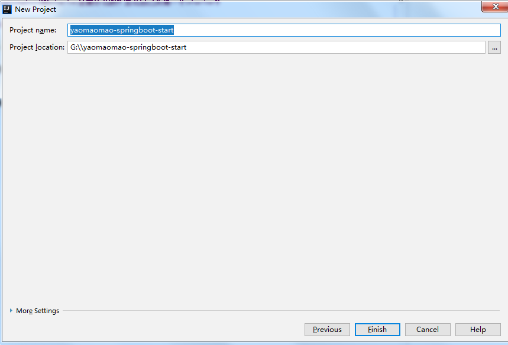

3、Finish，选择New Window，新打开一个idea项目工程。

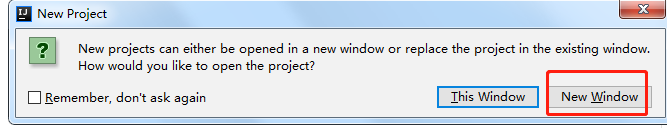

4、新建一个module，我们开始创建starter模块。

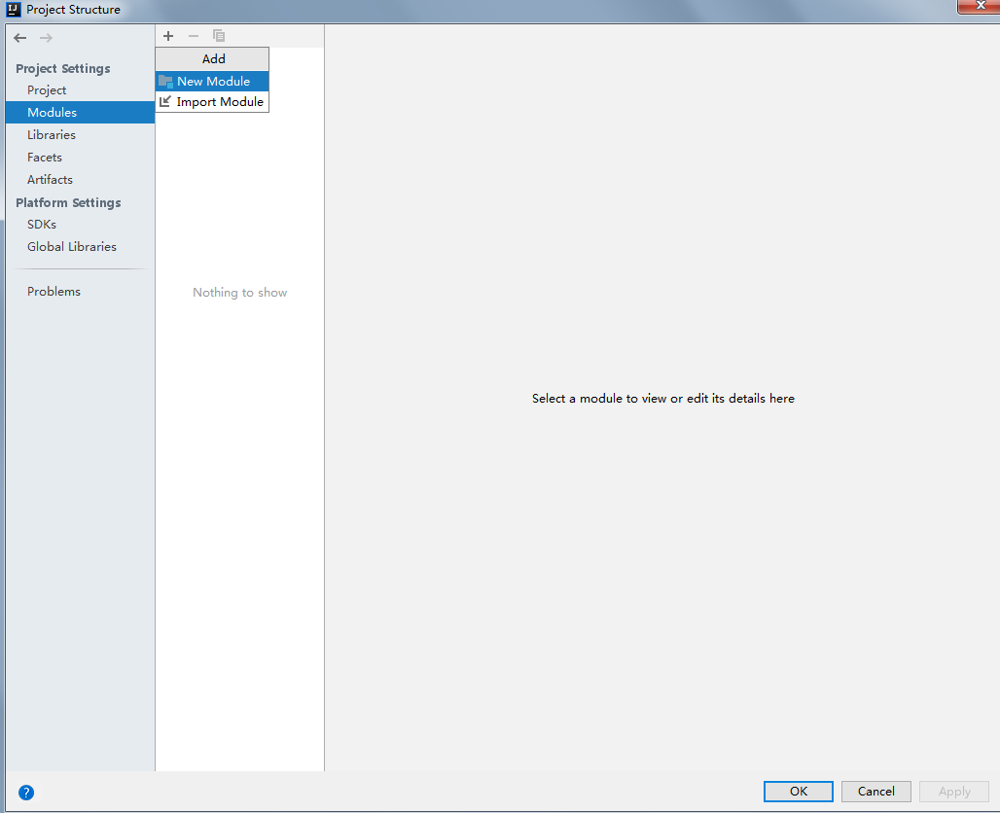

5、选择maven，JDK我用的1.8。

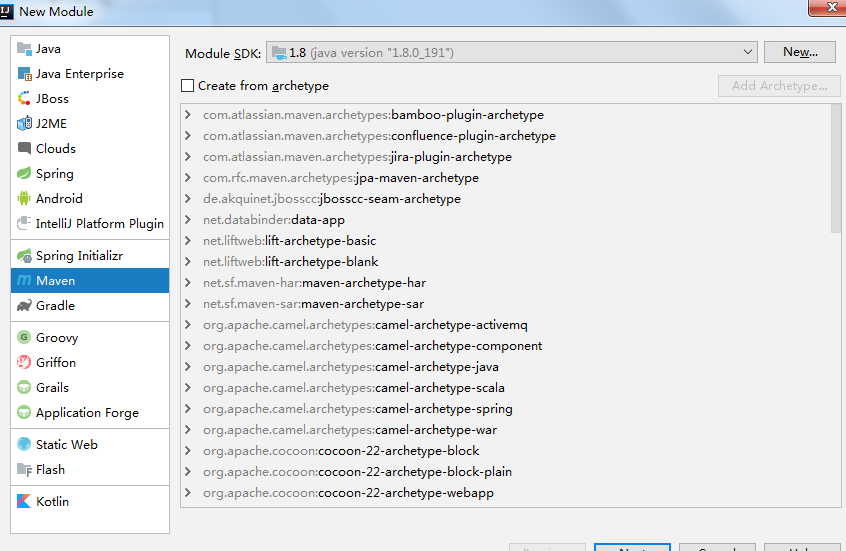

6、填写maven信息，GroupId我填的是com.yao.springboot-starter,AritfactId填的是yaomaomao-springboot-starter，version默认。

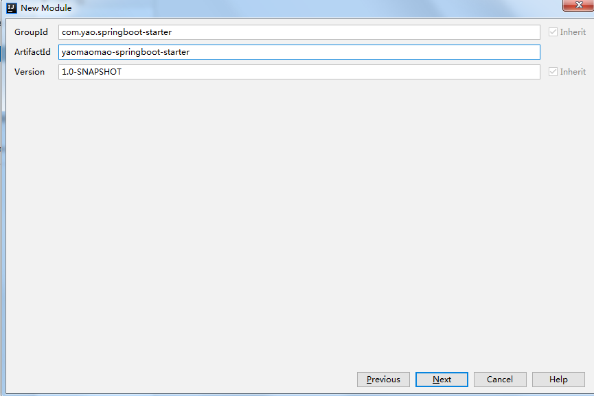

7、给module起个名字，module name 的名字我填的yaomaomao-springboot-starter，Content root及location同样如此。

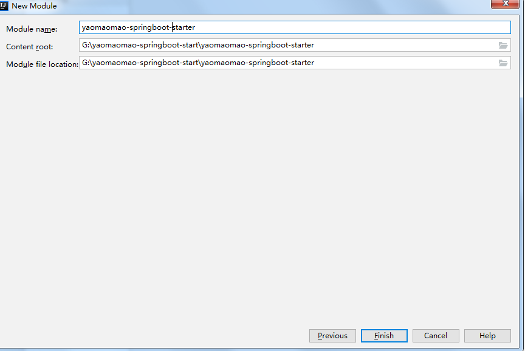

8、创建自动配置模块，重复4、5、6的步骤，然后填写maven信息，GroupId同样填写com.yao.springboot-starter，ArtifactId则不一样，这里我填写的yaomaomao-springboot-stater-autoConfiguration。

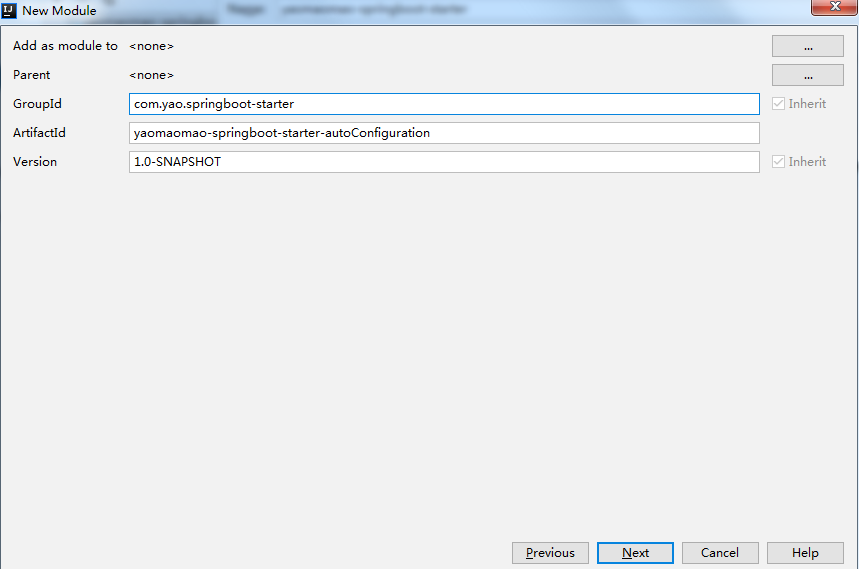

9、与第7步一样，配置moudle name ：yaomaomao-springboot-stater-autoConfiguration。


## 02 怎么进行自动装配？

1、引用POM

打开yaomaomao-springboot-starter-autoconfigurer，在pom中引入spring-boot-starter，pom.xml如下：

```
<?xml version="1.0" encoding="UTF-8"?>
<project xmlns="http://maven.apache.org/POM/4.0.0"
         xmlns:xsi="http://www.w3.org/2001/XMLSchema-instance"
         xsi:schemaLocation="http://maven.apache.org/POM/4.0.0 http://maven.apache.org/xsd/maven-4.0.0.xsd">
    <modelVersion>4.0.0</modelVersion>

    <groupId>com.yao.springboot-starter</groupId>
    <artifactId>yaomaomao-springboot-stater-autoConfiguration</artifactId>
    <version>1.0-SNAPSHOT</version>

    <!-- 指定springboot 依赖版本号-->
    <parent>
        <groupId>org.springframework.boot</groupId>
        <artifactId>spring-boot-starter-parent</artifactId>
        <version>2.2.1.RELEASE</version>
        <relativePath/> <!-- lookup parent from repository -->
    </parent>

    <dependencies>
        <!--引入spring-boot-starter；所有starter的基本配置-->
        <dependency>
            <groupId>org.springframework.boot</groupId>
            <artifactId>spring-boot-starter</artifactId>
        </dependency>
    </dependencies>


</project>
```

2、创建YaomaomaoProperties

在yaomaomao-springboot-starter-autoconfigurer这个module下，新建一个YaomaomaoProperties类，路径为 src\main\java\com\yao。

```
package com.yao;

import org.springframework.boot.context.properties.ConfigurationProperties;
import org.springframework.stereotype.Repository;

/**
 * @author 姚毛毛
 * @version V1.0
 * @Description: 仿照dataSource写个自动配置类
 * @date 2020/02/29
 */
@ConfigurationProperties(prefix = "spring.yaomaomao")
// 此注解表示在application.properties中，以spring.yaomaomao为前缀，映射赋值给这个类的字段
@Repository
public class YaomaomaoProperties {

    /* 连接地址 */
    private String url;

    /* 用户 */
    private String userName;

    /* 密码 */
    private String pwd;

    /* 数据库类型 */
    private String type;

    /* 驱动包 */
    private String driverClassName;

    public String getUrl() {
        return url;
    }

    public void setUrl(String url) {
        this.url = url;
    }

    public String getUserName() {
        return userName;
    }

    public void setUserName(String userName) {
        this.userName = userName;
    }

    public String getPwd() {
        return pwd;
    }

    public void setPwd(String pwd) {
        this.pwd = pwd;
    }

    public String getType() {
        return type;
    }

    public void setType(String type) {
        this.type = type;
    }

    public String getDriverClassName() {
        return driverClassName;
    }

    public void setDriverClassName(String driverClassName) {
        this.driverClassName = driverClassName;
    }
}


```

3、创建YaomaomaoService

```
package com.yao;

public class YaomaomaoService {

    private YaomaomaoProperties yaomaomaoProperties;

    public void setYaomaomaoProperties(YaomaomaoProperties yaomaomaoProperties) {
        this.yaomaomaoProperties = yaomaomaoProperties;
    }

    public boolean connectJDBC() {

        System.out.println("数据库连接中");

        // 这里只是伪代码
        // 如果有数据库，也可以真正地加载driverClassName，进行JDBC连接
        System.out.println( "url=" + yaomaomaoProperties.getUrl() +
                ",\n userName=" + yaomaomaoProperties.getUserName() +
                ",\n pwd=" + yaomaomaoProperties.getPwd() +
                ",\n type=" + yaomaomaoProperties.getType() +
                ",\n driverClassName=" + yaomaomaoProperties.getDriverClassName() );

        System.out.println("连接成功");
        return true;
    }
```

4、创建自动配置类YaomaomaoAutoConfiguration

```
package com.yao;

import org.springframework.beans.factory.annotation.Autowired;
import org.springframework.boot.autoconfigure.condition.ConditionalOnWebApplication;
import org.springframework.boot.context.properties.EnableConfigurationProperties;
import org.springframework.context.annotation.Bean;
import org.springframework.context.annotation.Configuration;

@EnableConfigurationProperties(YaomaomaoProperties.class) // 指定自动装载类
@Configuration // 声明是配置类
@ConditionalOnWebApplication // web应用
public class YaomaomaoAutoConfiguration {

    @Autowired
    YaomaomaoProperties yaomaomaoProperties;

    @Bean
    public YaomaomaoService yaomaomaoService() {
        YaomaomaoService yaomaomaoService = new YaomaomaoService();
        yaomaomaoService.setYaomaomaoProperties(yaomaomaoProperties);
        return yaomaomaoService;
    }
}

```

5、创建spring.factories

在resources下新建META-INF文件夹，创建spring.factories文件，指向我们的自动装置类。

```
org.springframework.boot.autoconfigure.EnableAutoConfiguration=com.yao.YaomaomaoAutoConfiguration
```

6、starter中引用autoConfiguration

打开starter的module，在pom文件中添加如下内容，引入autoConfiguration

```
<dependencies>
    <dependency>
        <groupId>com.yao.springboot-starter</groupId>
        <artifactId>yaomaomao-springboot-stater-autoConfiguration</artifactId>
        <version>1.0-SNAPSHOT</version>
    </dependency>
</dependencies>
```

至此，一个自定义starter就完成了。

接下来就是测试看看效果。

注意：如果想被其他项目使用，需要依次把configuration、starter这两个module用maven install 打包进本地仓库，如图：

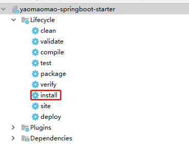

## 03 测试使用starter

1、新建web 项目

**新建一个springboot项目或者新建一个module都可以**。如果是新建一个springboot项目，则需要将starter install进本地maven仓库中，这里为了方便演示，是新建一个module。

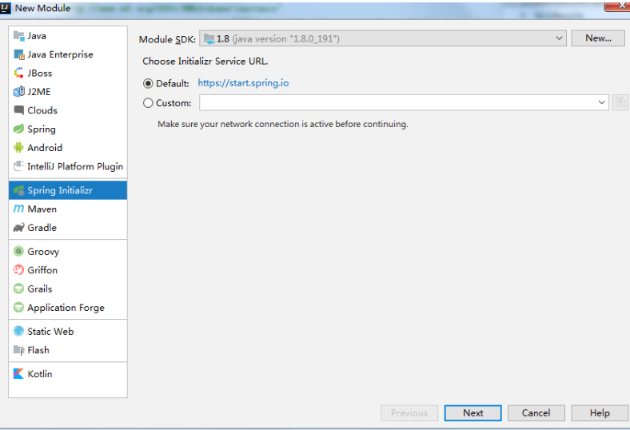

2、填写相关信息：

group -> com.yao

Artifact -> yaosweb

name -> yaosweb

Package -> com.yao.yaosweb

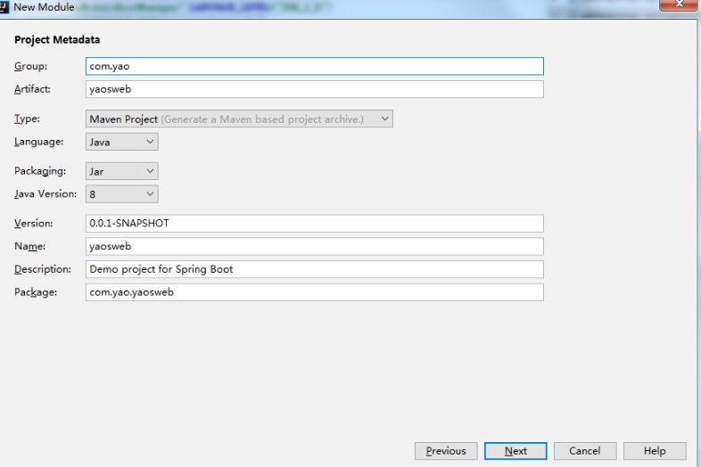

3、选择Web -> Spring Web Services，next。

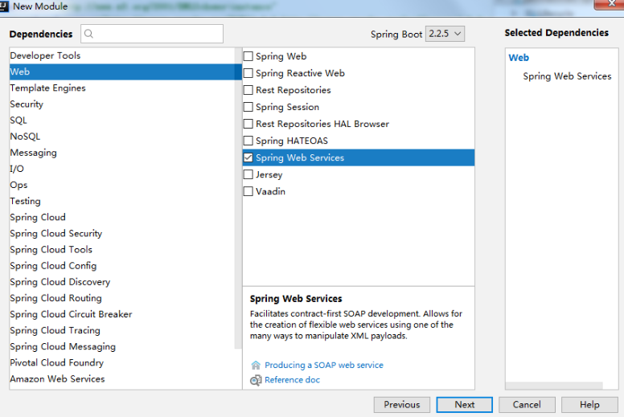

4、module name 设置为yaomaomao-springboot-web

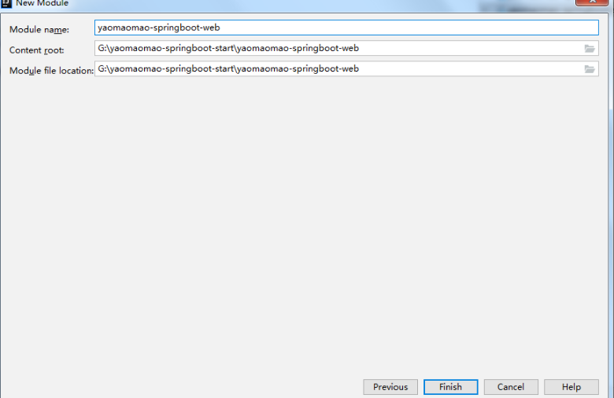

5、pom中引用starter

springboot 的web项目建立完毕，在pom中引用starter，添加内容如下：

```
<dependency>
    <groupId>com.yao.springboot-starter</groupId>
    <artifactId>yaomaomao-springboot-starter</artifactId>
    <version>1.0-SNAPSHOT</version>
</dependency>
```

6、application.properties中配置内容

```
spring.yaomaomao.url=jdbc:oracle:thin:@192.168.1.8:1521:orcl
spring.yaomaomao.username=yaomaomao
spring.yaomaomao.password=pWd123969
spring.yaomaomao.type=com.alibaba.druid.pool.DruidDataSource
spring.yaomaomao.driverClassName=oracle.jdbc.driver.OracleDriver
```

7、编码test类

在test中注入YaomaomaoService类，在contextLoads中调用connectJDBC()方法，内容如下：

```
package com.yao.yaosweb;

import com.yao.YaomaomaoService;
import org.junit.jupiter.api.Test;
import org.springframework.beans.factory.annotation.Autowired;
import org.springframework.boot.test.context.SpringBootTest;

@SpringBootTest
class YaoswebApplicationTests {

    @Autowired
    YaomaomaoService yaomaomaoService;

    @Test
    void contextLoads() {
        yaomaomaoService.connectJDBC();
    }

}
```

8、执行结果

```
数据库连接中
url=jdbc:oracle:thin:@192.168.1.8:1521:orcl,
 userName=yaomaomao,
 pwd=null,
 type=com.alibaba.druid.pool.DruidDataSource,
 driverClassName=oracle.jdbc.driver.OracleDriver
连接成功
2020-03-01 17:00:17.329  INFO 9820 --- [extShutdownHook] o.s.s.concurrent.ThreadPoolTaskExecutor  : Shutting down ExecutorService 'applicationTaskExecutor'

```

可以看到，是我们YaomaomaoService中connectJDBC方法展示的内容。

## 04 总结

最后，我们发现，其实starter是一个空jar。它唯一的目的是提供这个库所必须的依赖。

一个完整的starter一般包含一个autoconfigure模块（自动配置），一个starter模块（提供对autoconfigure模块及其它的依赖）。

再回忆下自定义starter的创建过程：

1、创建一个autoConfiguration模块，pom引入org.spring.boot。

2、在autoConfiguration模块下创建properties配置类，使用@ConfigurationProperties声明，使用prefix指定前缀，定义尽可能使用到的字段属性。

3、创建properties对应的service类，操作properties中的属性进行业务操作。

4、创建autoConfiguration类，使用@EnableAutoConfiguration注解进行自动装配，将service类注入到spring容器中。

5、创建META-INF/spring.factories，指定 org.springframework.boot.autoconfigure.EnableAutoConfiguration 的value是 我们开启自动装配注解(@EnableAutoConfiguration)的类。

6、创建一个starter模块，pom引入刚刚创建的autoConfiguration。

7、maven install 上面两个module。

8、新建一个module或project，引用starter的maven包。

9、写一个测试类，在application.properties文件中指定prefix前缀的配置变量，调用service中预先写好的方法，看看是否起作用。

一句话总结下自定义starter的核心点，就是利用@EnableAutoConfiguration这个注解进行自动映射。

本次练习的代码已在我的github上传，地址为：https://github.com/kiok1210/springboot-learn。